# MTG_Set_Analysis

## Introduction

This project aims to compare Magic the Gathering standard sets over time, observing changes in the style and power of cards.  Magic the Gathering (MTG) was first released in August, 1993, and is still a popular trading card game today.  With over 30 years and over 25,000 cards printed to standard sets, the variability in games is massive and fascinating.  Within any long-running trading card game, there is a concept known as *power creep*[^1].  This is when new cards have to compete against old cards, both in gameplay and in marketability.  For new cards to sell as well as possible, they need to feel more powerful and desirable than the cards players already own, so the power level continutes to rise over the years.  Eventually, this can lead to games becoming unplayable and dying out.  

Mark Rosewater, the Head Designer for Magic since 2003[^2], made a comment in a 2013 interview[^3] about how he and his team are trying to address power creep: "Our development team has a process that I call the Escher Stairwell (named after a classic painting by the famous artist). Each set has things that go up in power while other things are brought down in power. This creates the illusion that the power is always going up because the focus is where we are pushing the power. This technique helps to create the illusion of the power increasing when, in fact, it actually stays pretty even."  Despite his comment and efforts, many players still believe power creep to be a real and genuine threat to the card game they love.

As such, I decided to attempt to look into it analytically.  The first stage of this project is looking at numerical and categorical card data, values that broker no argument as to their meaning or relevance.  These values are as follows:

  1. ***Converted Mana Cost (CMC)***: Mana is a resource produced by land cards that is used to play other cards and activate certain abilities.  The mana cost of a card includes the color(s) and value of mana required to play it.  CMC is the total value needed, disregarding color.  A common practice to judge the strength of a set is to look at the abilities and statistics of the cards with a CMC of 3.
  2. ***Color***: Most lands produce only one or two colors of mana, so most decks are also limited in which colors they play.  Each color and color pair support different play styles and have different synergies with each other.  Multicolor cards, colloquially known as 'gold cards,' are often the core of a deck, with other cards chosen to support and bolster those gold cards.
  3. ***Type***: Cards come in different categories, which each have their own rules for play.  The most common are as follows:
       - *Land*: Lands have no mana cost, and instead produce mana.  Only one land can be played a turn, unless there is a card in play that works around that rule.
       - *Creature*: Creatures are the most common card type in MTG.  These cards attack opponents and block opponents from attacking you.  Many also have additional abilities that will be included in this analysis in a later stage.
       - *Artifacts and Enchantments*: Artifacts and enchantments are cards that stay in play and have an effect (passive or activated) on players, cards, or the game state in general. These cards cannot attack or block.
       - *Instants*: Instants can be cast at any time, often in response to another action.  They do not remain in play, and their effect is short lived.
       - *Sorceries*:  Sorceries, like instants, have a short lived effect and do not remain in play.  Unlike instants, they can only be cast on your turn.
       - *Planeswalkers*: Planeswalkers are powerful commanders that can be targetted like a player.  They typically have two or three abilities, one of which can be activated on each of your turns.  These abilities affect a planeswalker's *loyalty*, either increasing or decreasing the loyalty.
  4. ***Supertype***: Supertypes are an additional descriptor added to the main card types, i.e. a _Legendary_ Creature.  The supertypes in MTG are: basic, legendary, snow, tribal, and world.  Snow, tribal, and world are limited in their use, but legendary cards are in nearly every set.  Legendary cards are typically more powerful, but a player can only have one copy in play at a time.  Basic applies only to lands, and refers to lands that produce a single color of mana with no additional abilities.
  5. ***Power***:  Power is the offensive capability of a creature card.  When a creature attacks, it deals damage equal to its power to a target planeswalker or player, or to a blocking creature used to defend the target.
  6. ***Toughness***: Toughness is the defensive capability of a creature card.  When a creature blocks or takes damage from another source, its toughness is reduced by that value until the end of the turn.  If the toughness is reduced to 0, the creature dies and is removed from play.
  7. ***Loyalty***: Loyalty is the value used by Planeswalkers.  Their abilities increase or decrease loyalty, and attacks against a planeswalker reduce its loyalty permanently.  If loyalty reaches 0, the planeswalker is removed from play.
  8. ***Rarity***:  Rarity indicates the frequency with which a card is printed, and is also a good way to approximate power level.  The rarities are common, uncommon, rare, and mythic rare.  Some older cards were printed at one rarity in their original set, and then reprinted or changed to a different rarity as card standards change and their effectiveness was seen in competitive play.

## Scraping the Data

I used Python's [Beautiful Soup](https://beautiful-soup-4.readthedocs.io/en/latest/) and [Splinter](https://splinter.readthedocs.io/en/stable/) libraries to scrape this data from [Scryfall](https://scryfall.com/sets), a website that indexes Magic cards.  I find Scryfall easy to navigate, with all the data I was looking for conveniently arranged.  In [set_scrape.py](set_scrape.py), I created two functions: `scrapeCardList` and `scrapeCards`.  `scrapeCardList` uses a link to a particular set, and scrapes the name, link, and release date of each card.  `scrapeCards` then uses the list of card links to collect the power, toughness, loyalty, mana cost, rarity, full card type, and text from each card.  Mana cost is expressed as {number}{color}{color}, so I was able to extract the CMC and the colors of each card within the `scrapeCards` function.  Loyalty and toughness were grouped together for convenience, as no card could have both and it prevented having a mostly empty Loyalty list.  The full card type was split into supertypes, types, and subtypes.  Subtypes have not been used in this project, but they are simply subclassifications of cards, such as dragon or equipment.

## Results

The final results of the scraping were exported to PostgreSQL using Python's Pandas library, and from Postgres were exported to an Excel file to be used with Tableau.  I used Tableau to analyze how these various card metrics have changed over time, the full results of which can be viewed through [Tableau Public here](https://public.tableau.com/app/profile/sjschmitt13/viz/MTG_Sets_Prelim/colorcountbyset), but I will review a few of the more interesting and relevant results below.

### Power and Toughness

Comparing the power and toughness of a 1 CMC creature to that of a 15 CMC creature is essentially meaningless, so many comparisons are made by looking at a single CMC value.  3 is the most common CMC value, so that is often what's used.  Here, for example, I compare the median and average powers and toughnesses of 3 CMC creatures over time. 

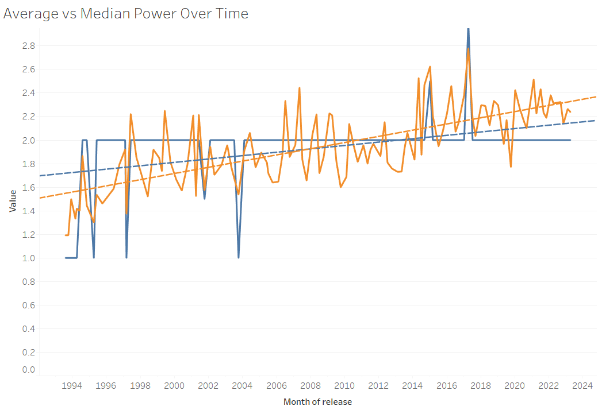  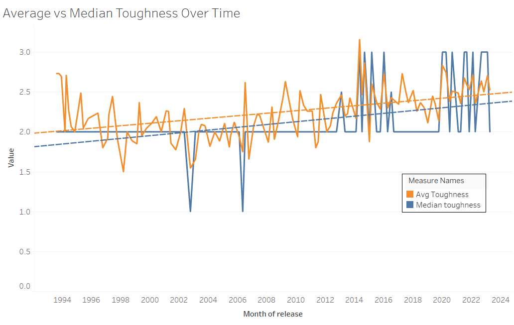

As we can see, both the average and median values for power and toughness have positive trends, with the average power increasing at the greatest rate.  The median power is consistently 2, though in the past the exceptions were 1 power and more recently the exceptions are 3 power instead.  The median power is trending upwards at a slightly greater rate than the average power, changing from a consistent 2 in the past to the more recent oscillation between 2 and 3.  Power and toughness alone do not determine the strength of a card, but this baseline does support an idea of power creep, at least amongst creatures.

It is also fairly common practice to compare the power and toughness to the CMC to determine if a card is good or not.  As such, I compared the sum of a card's power and toughness to its CMC, and took the average for each set.

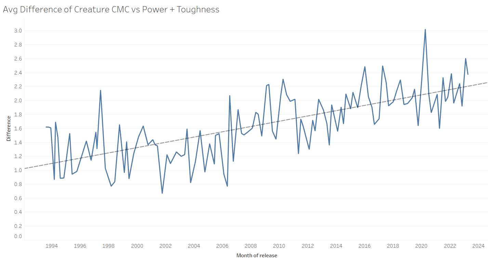

This difference has been trending upwards, with an approximate average of 1.45 for the first 5 sets and 2.22 for the 5 most recent sets.  This shows that players are getting more power and toughness for less mana than they used to.

### Legendary Creatures

Legendary creatures are cards that decks are often built around.  They are generally stronger than nonlegendary creatures of the same CMC, though often that strength comes through abilities more than numbers.  As such, I looked into the percent of each set that is legendary, to see if that ratio has been changing over time.

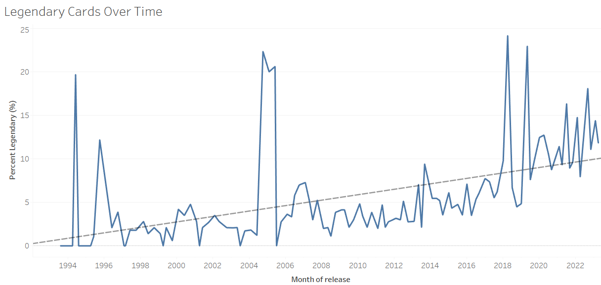

We can plainly see that the ratio of legendary to nonlegendary cards is increasing over time, with 9th Edition (released in June, 2005) being the last set to have no legendary cards.

I also compared the average power and toughness of 3 CMC legendary cards to that of 3 CMC nonlegendary cards over time, to see if the legendaries were increasing in number but decreasing in numerical strength.

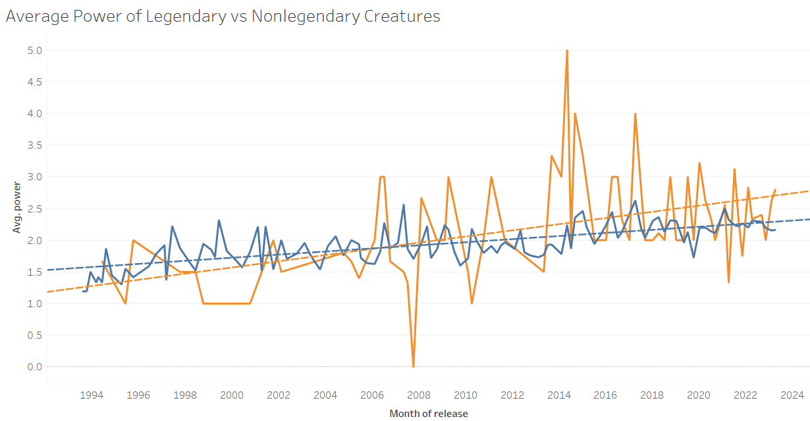 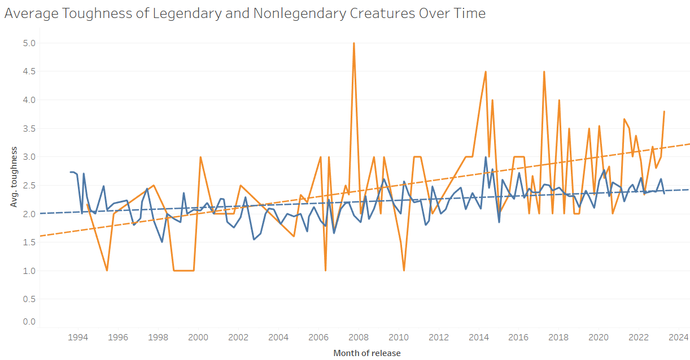

Here we see that the average power and toughness of legendaries were once lower than those of nonlegendaries, but that is no longer the case.  While the power and toughness of all cards are trending upwards, the average power of legendary creatures is increasing at nearly twice the rate of nonlegendary creatures, and the average toughness of legendaries is increasing at nearly four times the rate of nonlegendaries.

### Planeswalkers

Planeswalkers were introduced in the Lorwyn set, which was released in October, 2007.  The introduction of this new card type was one of the biggest changes to the way the game is played, with planeswalkers adding new rules and new strategies to consider, whether you choose to include them in your deck or not.  The value of planeswalkers comes from the options they provide, with most giving two or three actions you can choose from each turn.  Beginning in War of the Spark in May, 2019, some planeswalkers have a passive ability instead of one of the activated options.  

The average CMC of planeswalkers was 4.2 when they were first introduced, and 4 remains the most common CMC for a planeswalker to have, with 92 of the 263 cards (about 35%) used in my calculations having that value.  Planeswalkers are not very common, though, making their raw numbers difficult to work with.  Only three standard sets contain more than 10, and only five sets contain more than 6, whereas nine sets have a single planeswalker. 

### Multicolor Cards

Multicolor cards, or gold cards, are harder to play than single color cards, as they require more specific lands.  As a tradeoff, they usually are stronger than single color cards.  Here, we see the average difference between the cmc and the sum of power and toughness of multicolor and single color cards by set.

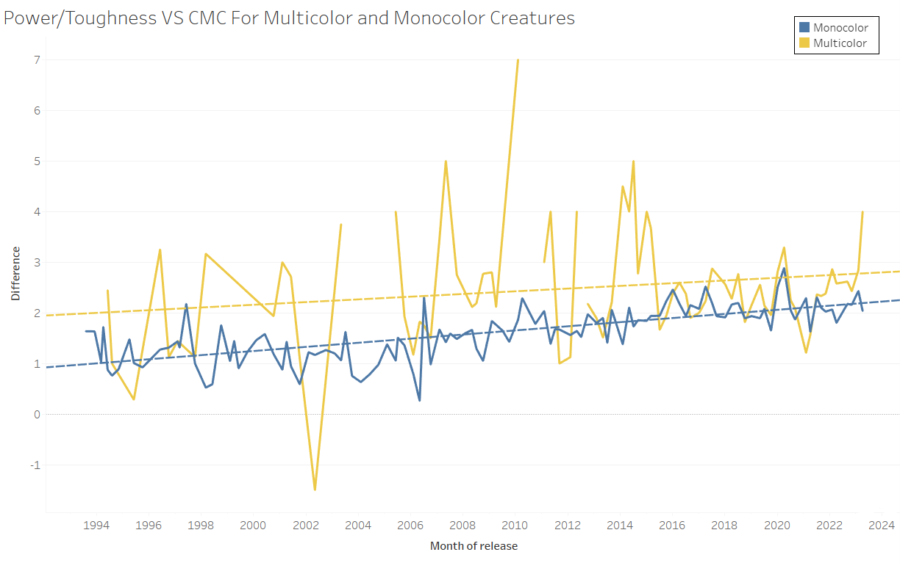

The power and toughness compared to cmc is higher for multicolor cards than for single color cards, though single color cards are trending upwards at a slightly greater rate.  At the same time, the general trend is that newer sets have a greater percentage of multicolor cards than older sets, with Magic 2014 in July, 2013 being the last standard set with no multicolor cards at all.  

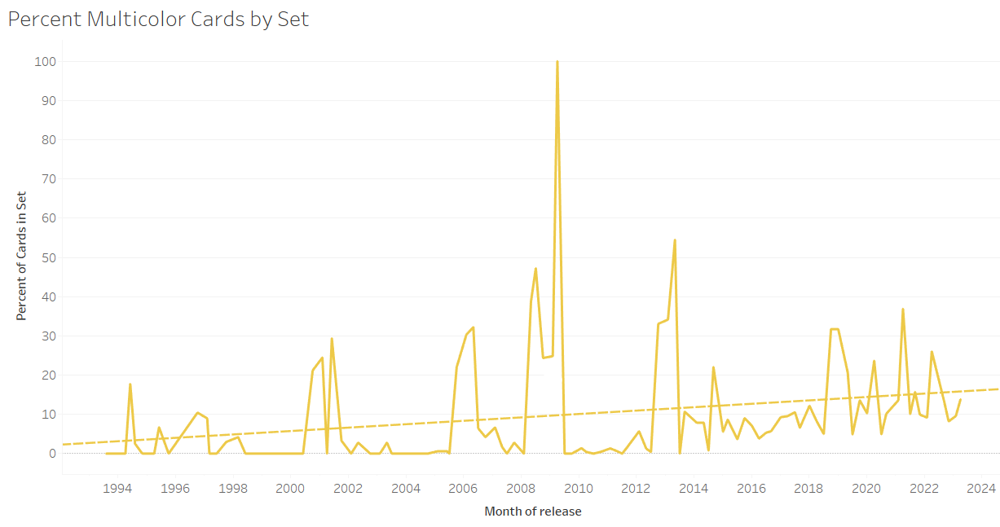

### Rarity 

The rarity of a card is dependent on how powerful a card is expected to be - the higher the rarity, the more desirable the card.  As such, it is not surprising to see that mythic rare cards and rare cards generally have a greater difference between power/toughness and CMC than common and uncommon cards.

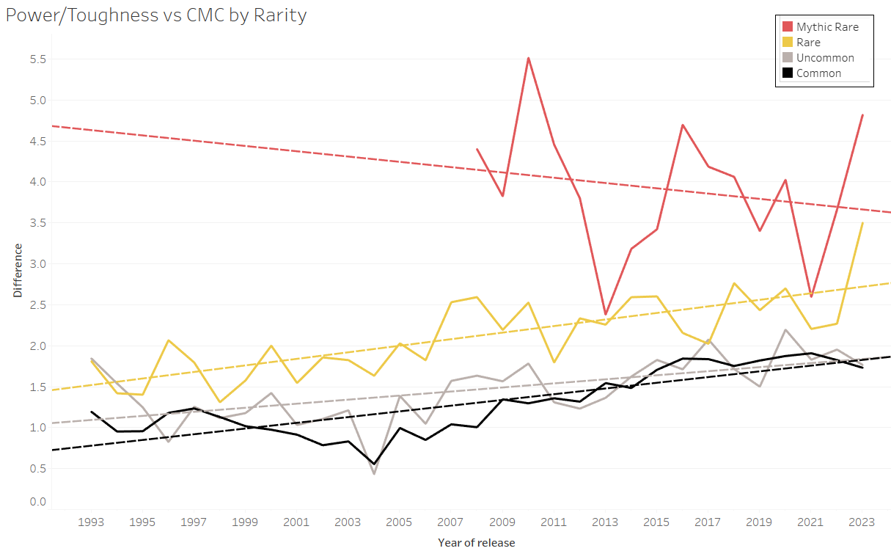

It may be surprising to see that that value for mythic rare cards is trending down, while every other rarity is trending up, but mythic rare was only introduced in Shards of Alara in October, 2008, and has had the least time to find their balance.  Also, there are significantly fewer mythic rare cards than any other type, so any variance shows more drastically.  Rare cards are increasing in this difference ever so slightly faster than common cards.

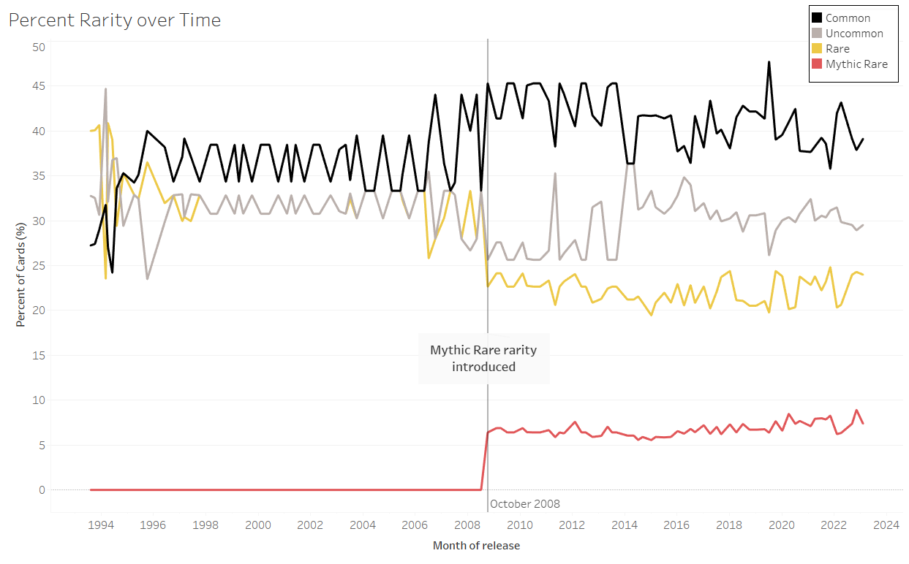

Since magic was created, the percentage of common cards in each set has been trending upwards.  The percentage of rare and mythic rare cards has been decreasing.  In the last ten years, since April 2013, this trend is reversed, with the percentage of rare cards increasing and common cards decreasing. 

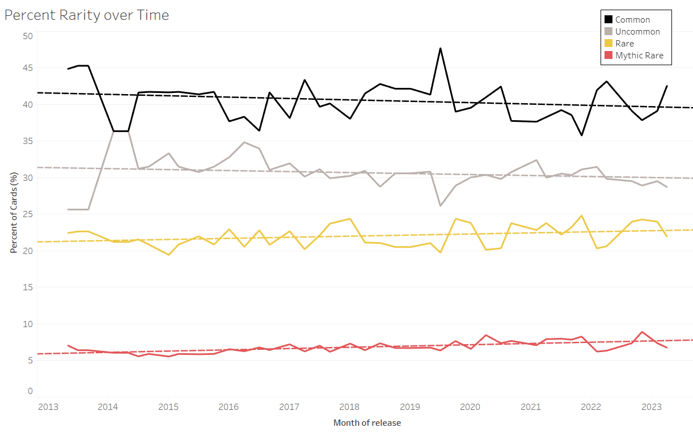

<!-- ## Challenges

-->

## Conclusion

There are many more interactive visualizations in my Tableau viz, with filters set up to make it easy to find answers to specific questions, but unfortunately these numbers and categories alone barely scrape the surface of what Magic the Gathering cards can do.  Most of the strength and strategy of a card is based on its text, which is why the next stage of my analysis is to begin parsing the text of each card.  I plan to compare each card type, grouping cards by similar abilities and comparing the cost and power of those effects.  In this next stage, these groups will likely be fairly broad, with the goal of becoming more specific as I progress.  Another value I hope to eventually include is the market price for each card, as cards that do well in competitive play are usually more expensive than those that do not. 

[^1]: [MTG Wiki: Power Creep](https://mtg.fandom.com/wiki/Power_creep)
[^2]: [Mark Rosewater Wikipedia](https://en.wikipedia.org/wiki/Mark_Rosewater)
[^3]: [Mudrc (January 28, 2013) Interview with Mark Rosewater](http://www.mysticshop.cz/blog/interview-with-mark-rosewater/)
